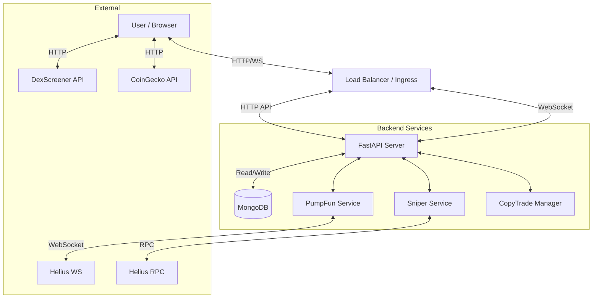

# System Architecture

## High-Level Overview
The application follows a modern full-stack architecture, utilizing a **FastAPI** backend for heavy lifting (blockchain interaction, WebSocket management) and a **React** frontend for the interactive trading interface. Data persistence is handled by **MongoDB**.

## 1. Frontend (React)
- **Framework**: React 18 (Create React App).
- **Styling**: Tailwind CSS, Shadcn UI components.
- **State Management**: Context API (`PumpFunContext` for data, `WalletContext` for auth).
- **Web3**: `@solana/web3.js`, `@solana/wallet-adapter`.
- **Optimization**: Uses `useRef` and throttled intervals (500ms) to manage high-frequency updates without freezing the UI.

### Key Components
- `PumpFunContext.jsx`: The "brain" of the frontend. Connects to the backend WebSocket, manages the token list state (Map for O(1) access), fetches metadata, and handles market data updates.
- `SniperPanel.jsx`: The execution interface. Handles Buy/Sell logic, interacts with the backend to build transactions, and requests user signature.
- `CopyTradePanel.jsx`: Manages the copy trading watchlist and listens for copy signals.

## 2. Backend (Python/FastAPI)
The backend acts as a bridge between the Solana blockchain and the frontend user.

### Core Services
- **`server.py`**: The entry point. Hosts the REST API endpoints and the WebSocket server for the frontend.
- **`pumpfun_service.py`**: A robust background service that maintains a persistent WebSocket connection to **Helius**.
    - Subscribes to Pump.fun Program Logs.
    - Parses raw binary logs into structured events (`createEvent`, `tradeEvent`, `completeEvent`).
    - Broadcasts parsed events to all connected frontend clients via WebSocket.
- **`sniper_service.py`**: Handles blockchain transaction construction.
    - Fetches Bonding Curve accounts via RPC.
    - Calculates exact token amounts and slippage.
    - Builds raw instructions (Buy, Sell, Create ATA).
    - Returns Base64-encoded transactions for the frontend to sign.
- **`copytrade_service.py`**: Contains the logic for the Copy Trader.
    - Maintains an in-memory cache of target wallets from MongoDB.
    - Filters every incoming trade from `pumpfun_service` against the target list.
    - Generates `copyTradeSignal` events when a match is found.

## 3. Database (MongoDB)
Used for persisting user data that needs to survive session restarts.
- **`positions`**: Stores active and closed sniper positions (Entry price, PnL, Token, Status).
- **`copy_targets`**: Stores the user's watchlist for copy trading (Target Wallet, Amount, Settings).
- **`status_checks`**: System health logs (legacy).

## 4. External Integrations
- **Helius**: The backbone of the application.
    - **WebSocket**: Used for the global stream of all Pump.fun activity.
    - **RPC**: Used to fetch recent migration history (via `getSignaturesForAddress`) and token metadata (DAS API).
- **DexScreener**: Used by the Frontend to fetch live market data (Price, Liquidity, FDV) for tokens that have migrated to Raydium/PumpSwap.
- **CoinGecko**: Fetches the global SOL price.
